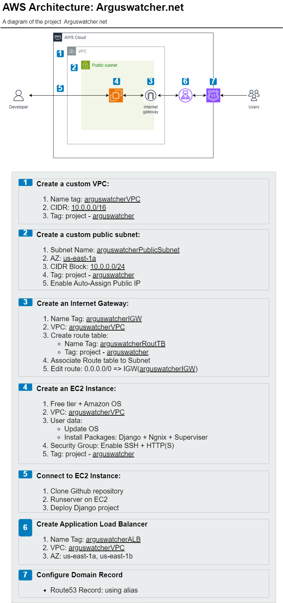

# Project - Personal Blog Website(Arguswatcher.net)

A repo for Arguswatcher.net

---

## Overview

A Django-based blog platform showcasing web development proficiency. Users can seamlessly create, update, and delete blog posts. Each post supports hashtags for easy categorization and content discovery.

---

## Key Features

- User Authentication
- Blog Management (Create, Update, Delete)
- Hashtag Functionality for Categorization

---

## Tech Stack

- Django Framework
  - HTML, CSS, JavaScript
  - Database with Django ORM
- AWS Cloud

---

## AWS Architecture Diagram

- Using [draw.io](https://draw.io/)

---

## Documentation

[Document V0.1](./doc/v0.1/tech_doc_v0.1.md)

---

[Top](#project---personal-blog-websitearguswatchernet)
