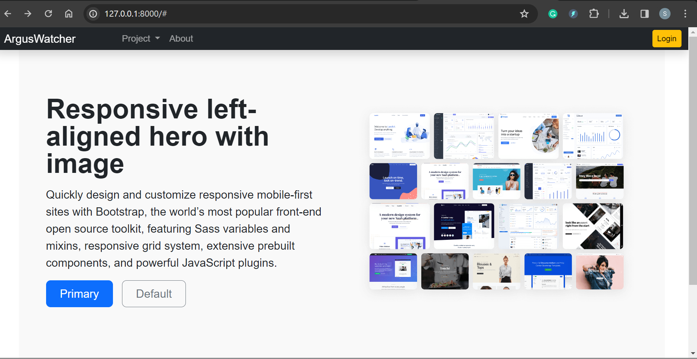
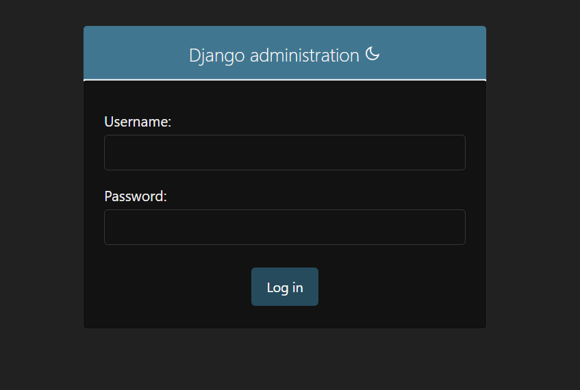

## ArgusWatcher - Document v0.1

[Back](/README.md)

- [ArgusWatcher - Document v0.1](#arguswatcher---document-v01)
- [Requirements](#requirements)
  - [Current Version:](#current-version)
  - [Future Version](#future-version)
- [Application Development](#application-development)
  - [Create Django Project](#create-django-project)
  - [Home Page](#home-page)
  - [Static Files](#static-files)
  - [Database](#database)
  - [Test Application locally](#test-application-locally)
  - [Output installed packages](#output-installed-packages)
- [Push Github](#push-github)

---

## Requirements

### Current Version:

- [x] Django proejct development:
  - [x] startproject: `arguswatcher`
  - [x] template:
    - [x] index.html(HTML+CSS)
    - [x] settings: template directory
  - [x] collectstatic
  - [x] database
    - [x] default sqlite
    - [x] migrate
- [x] Output installed packages(pip freeze)
- [ ] Git push
- [ ] Create AWS resource
- [ ] Tesing with domain
- [ ] Architecture Diagram

---

### Future Version

- AWS Cloud resources:

  - CICD
  - SSM: evivronment variable
  - Connect to RDS

- Project:

  - Functionality: Account Management
  - Functionality: Blog Management

---

## Application Development

### Create Django Project

- Create and activate virtual environment

```bash
py -m venv env # create virtual environment
```

- Install Django

```bash
python.exe -m pip install --upgrade pip # upgrade pip
pip install django
```

- Start project: `Arguswatcher`

```bash
django-admin startproject Arguswatcher  # Start project
py ./Arguswatcher/manage.py runserver 8000  # Starts a lightweight development web server locally
```

- Create VSCode `launch.json` file

---

### Home Page

- `Arguswatcher/views.py`

```py
from django.views.generic.base import TemplateView


# View of home page
class HomeView(TemplateView):
    template_name = "home.html"     # the template of this view

    # define the context data
    def get_context_data(self, **kwargs):
        context = super().get_context_data(**kwargs)
        # a dictionary representing the context
        context["msg"] = "hellow world"
        return context
```

---

- `Arguswatcher/urls.py`

```py
from django.contrib import admin
from django.urls import path
from .views import HomeView

urlpatterns = [
    path('', HomeView.as_view(), name="home"),
    path('admin/', admin.site.urls),
]
```

---

- `Arguswatcher/templates/layout`

  - `base.html`
  - `nav.html`
  - `footer.html`

- `Arguswatcher/templates/`

  - `index.html`

---

### Static Files

- `Arguswatcher/static/`

  - `css/style.css`
  - `img/home.png`

---

- `Arguswatcher/Arguswatcher/settings.py`

```py
# region Static

# URL to use when referring to static files located in STATIC_ROOT.
STATIC_URL = 'static/'
# defines the additional locations the staticfiles app will traverse
STATICFILES_DIRS = [
    BASE_DIR / 'static',
]
# The absolute path to the directory where collectstatic will collect static files for deployment.
STATIC_ROOT = Path(BASE_DIR, 'collectstatic')

# endregion
```

---

- Collect static files

```bash
py ./Arguswatcher/manage.py collectstatic
```

---

### Database

- Using sqlite3
- Migrate

```bash
# creating new migrations based on the changes
py ./Arguswatcher/manage.py makemigrations  # No changes detected
# applying migrations.
py ./Arguswatcher/manage.py migrate  #  Apply all migrations: admin, auth, contenttypes, sessions
```

---

### Test Application locally

- Home



- Admin



---

### Output installed packages

```bash
pip freeze > requirements.txt
```

---

## Push Github

```bash
git add -A  # Add all file contents to the index.
git commit -m "create django project Arguswatcher"  # Record changes to the repository


```
