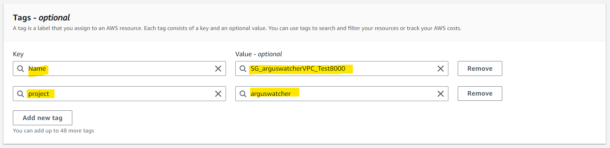
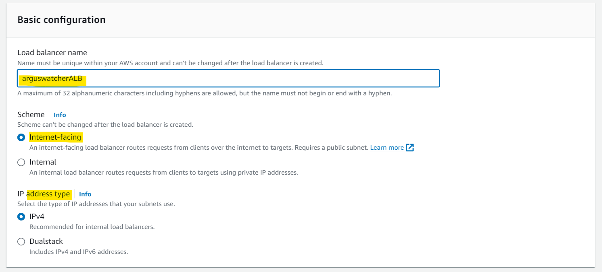
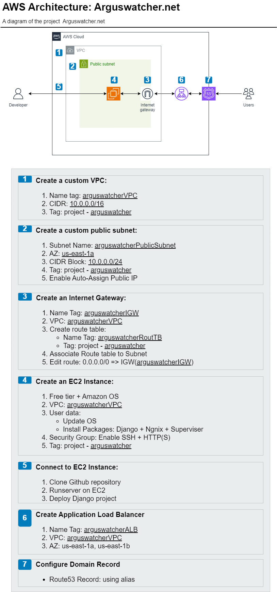

## ArgusWatcher - Document v0.1

[Back](/README.md)

- [ArgusWatcher - Document v0.1](#arguswatcher---document-v01)
- [Requirements](#requirements)
- [Application Development](#application-development)
  - [Clone Repo](#clone-repo)
  - [Create Django Project](#create-django-project)
  - [Home Page](#home-page)
  - [Static Files](#static-files)
  - [Database](#database)
  - [Test Application locally](#test-application-locally)
  - [Output installed packages](#output-installed-packages)
  - [Push Github](#push-github)
- [Create AWS resource](#create-aws-resource)
  - [Create a new custom VPC](#create-a-new-custom-vpc)
  - [Create new custom public subnets](#create-new-custom-public-subnets)
  - [Create an Internet Gateway](#create-an-internet-gateway)
  - [Edit VPC's route table](#edit-vpcs-route-table)
  - [Create new security groups](#create-new-security-groups)
  - [Create a new EC2 instance](#create-a-new-ec2-instance)
  - [Deploy Djnago project](#deploy-djnago-project)
    - [Clone Github repository](#clone-github-repository)
    - [Install and configure `gunicorn`](#install-and-configure-gunicorn)
    - [Install and configure `nginx`](#install-and-configure-nginx)
    - [Install and configure `supervisor`](#install-and-configure-supervisor)
    - [Visit public IP](#visit-public-ip)
  - [Create a new Application Load Balancer](#create-a-new-application-load-balancer)
  - [Configure domain name](#configure-domain-name)
- [Architecture Diagram](#architecture-diagram)
- [Summary](#summary)
  - [Django Application](#django-application)
  - [AWS resources](#aws-resources)
  - [Challengs and lessons](#challengs-and-lessons)
  - [Future Version](#future-version)
- [Appendix](#appendix)

---

## Requirements

- [x] Create a new repository [AWS_arguswatcher.net](https://github.com/simonangel-fong/AWS_arguswatcher.net.git)
  - [x] Clone repo
- [x] Django proejct development:
  - [x] startproject: `arguswatcher`
  - [x] urls
  - [x] views
  - [x] template:
    - [x] index.html(HTML+CSS)
    - [x] settings: template directory
  - [x] collectstatic
  - [x] database
    - [x] default sqlite
    - [x] migrate
- [x] Output installed packages(pip freeze)
- [x] Git push
- [x] Create AWS resource and deploy Django project
- [x] Tesing with domain
- [x] Architecture Diagram

---

## Application Development

### Clone Repo

```sh
git clone https://github.com/simonangel-fong/AWS_arguswatcher.net.git
```

---

### Create Django Project

- Create and activate virtual environment

```bash
py -m venv env # create virtual environment
```

- Install Django

```bash
python.exe -m pip install --upgrade pip # upgrade pip
pip install django
```

- Start project: `Arguswatcher`

```bash
django-admin startproject Arguswatcher  # Start project
py ./Arguswatcher/manage.py runserver 8000  # Starts a lightweight development web server locally
```

- Create VSCode `launch.json` file

---

### Home Page

- `Arguswatcher/views.py`

```py
from django.views.generic.base import TemplateView


# View of home page
class HomeView(TemplateView):
    template_name = "home.html"     # the template of this view

    # define the context data
    def get_context_data(self, **kwargs):
        context = super().get_context_data(**kwargs)
        # a dictionary representing the context
        context["msg"] = "hellow world"
        return context
```

---

- `Arguswatcher/urls.py`

```py
from django.contrib import admin
from django.urls import path
from .views import HomeView

urlpatterns = [
    path('', HomeView.as_view(), name="home"),
    path('admin/', admin.site.urls),
]
```

---

- `Arguswatcher/templates/layout`

  - `base.html`
  - `nav.html`
  - `footer.html`

- `Arguswatcher/templates/`

  - `index.html`

---

### Static Files

- `Arguswatcher/static/`

  - `css/style.css`
  - `img/home.png`

---

- `Arguswatcher/Arguswatcher/settings.py`

```py
# region Static

# URL to use when referring to static files located in STATIC_ROOT.
STATIC_URL = 'static/'
# defines the additional locations the staticfiles app will traverse
STATICFILES_DIRS = [
    BASE_DIR / 'static',
]
# The absolute path to the directory where collectstatic will collect static files for deployment.
STATIC_ROOT = Path(BASE_DIR, 'collectstatic')

# endregion
```

---

- Collect static files

```bash
py ./Arguswatcher/manage.py collectstatic
```

---

### Database

- Using sqlite3
- Migrate

```bash
# creating new migrations based on the changes
py ./Arguswatcher/manage.py makemigrations  # No changes detected
# applying migrations.
py ./Arguswatcher/manage.py migrate  #  Apply all migrations: admin, auth, contenttypes, sessions
```

---

### Test Application locally

- Home


- Admin


---

### Output installed packages

```bash
pip freeze > requirements.txt
```

---

### Push Github

```bash
git add -A  # Add all file contents to the index.
git log --oneline -4   # Show commit logs
git commit -m "create django project Arguswatcher"  # Record changes to the repository
git push  # Update remote repo
```

---

## Create AWS resource

### Create a new custom VPC


---

### Create new custom public subnets

- Create a new public subnet within us-east-1a


- Enable auto-assign public IP


- Create a new public subnet within us-east-1b
  - required by ALB, which needs multiple AZ.


- Enable auto-assign public IP


---

### Create an Internet Gateway

- Create an IGW, enabling access to Internet.


- Attach to the target VPC


---

### Edit VPC's route table


- Edit route rule


---

### Create new security groups

- A security group allowing SSH


- A security group allowing HTTP


- A security group allowing port 8000




---

### Create a new EC2 instance

- Free tier + Ubuntu
- Network:
  - custom public subnet
  - SG


---

### Deploy Djnago project

#### Clone Github repository

- Connect to EC2 with local git bash terminal


- Update OS

```sh
sudo DEBIAN_FRONTEND=noninteractive apt-get -y update
sudo DEBIAN_FRONTEND=noninteractive apt-get -y upgrade
```


- Install python3-venv package

```bash
sudo DEBIAN_FRONTEND=noninteractive apt-get -y install python3-venv
```


- Establish virtual environment

```bash
sudo rm -rf /home/ubuntu/env
python3 -m venv /home/ubuntu/env
```


- Download codes from github

```sh
sudo rm -rf /home/ubuntu/AWS_arguswatcher_net
git clone https://github.com/simonangel-fong/AWS_arguswatcher_net.git /home/ubuntu/AWS_arguswatcher_net
```


---

- Install app dependencies

```sh
source /home/ubuntu/env/bin/activate
pip install -r /home/ubuntu/AWS_arguswatcher_net/requirements.txt
pip list
```


---

- Migrate App

```sh
python3 /home/ubuntu/AWS_arguswatcher_net/Arguswatcher/manage.py makemigrations
python3 /home/ubuntu/AWS_arguswatcher_net/Arguswatcher/manage.py migrate
```


---

- Test on EC2 with port 8000

```sh
python3 /home/ubuntu/AWS_arguswatcher_net/Arguswatcher/manage.py runserver 0.0.0.0:8000
```


- press `ctrl` + `c` to end testing.

---

#### Install and configure `gunicorn`

- Install gunicorn in venv

```sh
# require venv
pip install gunicorn
deactivate
```


---

- Configuration gunicorn.socket

```sh
socket_conf=/etc/systemd/system/gunicorn.socket

sudo bash -c "sudo cat >$socket_conf <<SOCK
[Unit]
Description=gunicorn socket

[Socket]
ListenStream=/run/gunicorn.sock

[Install]
WantedBy=sockets.target
SOCK"
```


- Configuration gunicorn.service

```sh
service_conf=/etc/systemd/system/gunicorn.service

sudo bash -c "sudo cat >$service_conf <<SERVICE
[Unit]
Description=gunicorn daemon
Requires=gunicorn.socket
After=network.target

[Service]
User=root
Group=www-data
WorkingDirectory=/home/ubuntu/AWS_arguswatcher_net/Arguswatcher
ExecStart=/home/ubuntu/env/bin/gunicorn \
    --access-logfile - \
    --workers 3 \
    --bind unix:/run/gunicorn.sock \
    Arguswatcher.wsgi:application

[Install]
WantedBy=multi-user.target
SERVICE"
```


---

- Apply gunicorn configuration

```sh
sudo systemctl start gunicorn.socket
sudo systemctl enable gunicorn.socket
sudo systemctl status gunicorn
```


- Visit port 8000 to test

```sh
source /home/ubuntu/env/bin/activate
cd /home/ubuntu/AWS_arguswatcher_net/Arguswatcher
gunicorn --bind 0.0.0.0:8000 Arguswatcher.wsgi:application
cd ~
deactivate
```


---

#### Install and configure `nginx`

- Install nginx

```sh
sudo apt-get install -y nginx
```


- Nginx default page


---

- modify nginx conf

```sh
nginx_conf=/etc/nginx/nginx.conf
sudo sed -i '1cuser root;' $nginx_conf
```


---

- create django.conf file

```sh
django_conf=/etc/nginx/sites-available/django.conf
sudo bash -c "cat >$django_conf <<DJANGO_CONF
server {
listen 80;
server_name $(dig +short myip.opendns.com @resolver1.opendns.com);
location = /favicon.ico { access_log off; log_not_found off; }
location /static/ {
    root /home/ubuntu/AWS_arguswatcher_net/Arguswatcher;
}

location /media/ {
    root /home/ubuntu/AWS_arguswatcher_net/Arguswatcher;
}

location / {
    include proxy_params;
    proxy_pass http://unix:/run/gunicorn.sock;
}
}
DJANGO_CONF"
```


---

- Creat link in sites-enabled directory

```sh
sudo ln -sf /etc/nginx/sites-available/django.conf /etc/nginx/sites-enabled
```


---

- Test and restart nginx

```sh
sudo nginx -t
sudo systemctl restart nginx
```


---

#### Install and configure `supervisor`

- Install supervisor

```sh
sudo apt-get install -y supervisor
```


- Configuration supervisor

```sh
sudo mkdir -p /var/log/gunicorn # create directory for logging

supervisor_gunicorn=/etc/supervisor/conf.d/gunicorn.conf # create configuration file
sudo bash -c "cat >$supervisor_gunicorn <<SUP_GUN
[program:gunicorn]
    directory=/home/ubuntu/AWS_arguswatcher_net/Arguswatcher
    command=/home/ubuntu/env/bin/gunicorn --workers 3 --bind unix:/run/gunicorn.sock  Arguswatcher.wsgi:application
    autostart=true
    autorestart=true
    stderr_logfile=/var/log/gunicorn/gunicorn.err.log
    stdout_logfile=/var/log/gunicorn/gunicorn.out.log

[group:guni]
    programs:gunicorn
SUP_GUN"

```


---

- update supervisor

```sh
sudo supervisorctl reread # tell supervisor read configuration file
sudo supervisorctl update # update supervisor configuration
sudo supervisorctl reload # Restarted supervisord
```


---

#### Visit public IP

- Visit App with public IP


---

### Create a new Application Load Balancer

- Create Target Group


- Create ALB
  - SG = SG_arguswatcher_HTTP




- Create new sg for EC2 instance to access to ALB's SG_arguswatcher_HTTP


- Update SG for EC2 instance


- Test EC2 public IP


- Access EC2 with SSH
  - Still available


- Access EC2 by ALB DNS name
  - Only display nginx default page
  - Because nginx's server_name allows only public ip.


---

### Configure domain name

- Update records


- Visit domain name, still access nginx default page.


- Update Nginx server_name

```sh
sudo nano /etc/nginx/sites-available/django.conf
# server_name www.arguswatcher.net arguswatcher.net;

sudo nginx -t
sudo systemctl restart nginx
```

- Visit domain name


---

## Architecture Diagram



---

## Summary

### Django Application

- Create Home page using
  - Built-in CBV,
  - Template inheritance
  - project level template
  - collect static

---

### AWS resources

- Collect data by tag name using `Tag Editor`:
  - `project : arguswatcher`


- Summary

| Resources Type  | Name                             | Key Values                          |
| --------------- | -------------------------------- | ----------------------------------- |
| VPC             | `arguswatcherVPC`                | CIDR:`10.0.0.0/16`                  |
| InternetGateway | `arguswatcherIGW`                | VPC:`arguswatcherVPC`               |
| Subnet          | `arguswatcherPublicSubnet`       | AZ:`us-east-1a`, CIDR:`10.0.0.0/24` |
| Subnet          | `arguswatcherPublicSubnetEast1b` | AZ:`us-east-1b`, CIDR:`10.0.1.0/24` |
| RouteTable      | `arguswatcherRouteTB`            | `0.0.0.0/0`:`arguswatcherIGW`       |
| EC2             | `arguswatcherEC2`                | Ubuntu, VPC:`arguswatcherVPC`       |
| AppLoadBalancer | `arguswatcherALB`                | VPC:`arguswatcherVPC`               |
| TargetGroup     | `arguswatcherTargetGroup`        | Instance: `arguswatcherEC2`         |
| SecurityGroup   | `SG_arguswatcher_EC2HTTP`        |                                     |
| SecurityGroup   | `SG_arguswatcherVPC_HTTP`        |                                     |
| SecurityGroup   | `SG_arguswatcherVPC_SSH`         |                                     |
| SecurityGroup   | `SG_arguswatcherVPC_Test8000`    |                                     |

---

### Challengs and lessons

- The Django project's deployment consumes most of the time since the completed projects were not reorganized and taken notes.
- Bash scripts should be reorganized to increase productivity.
- AWS resources are provisioned manually, leading to low efficiency. An automation solution is required.
- Memory is not reliable, but the notes are. Note-taking is an efficient way to learn a new skill, even though it takes time. The screenshot is required, especially about how the system replies when inputting a command.
- AWS SAA exam just provides a big picture of cloud services. Hands-on experiences are the key.

---

### Future Version

- Django Project:

  - Functionality: Account Management
  - Functionality: Blog Management

- AWS Cloud resources:

  - CICD
  - SSM: parameter store for evivronment variable
  - Connect to RDS MySQL

---

## Appendix

- Bash script to automate deployment
  - [deploy_django_ubuntu](./deploy_django_ubuntu.sh)

---

[TOP](#arguswatcher---document-v01)
