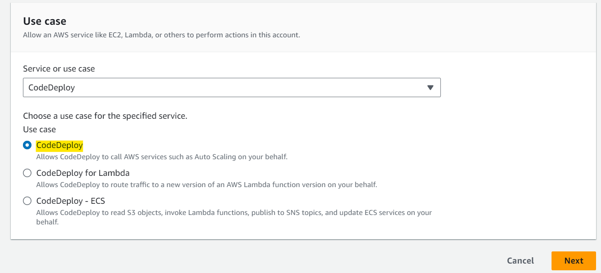
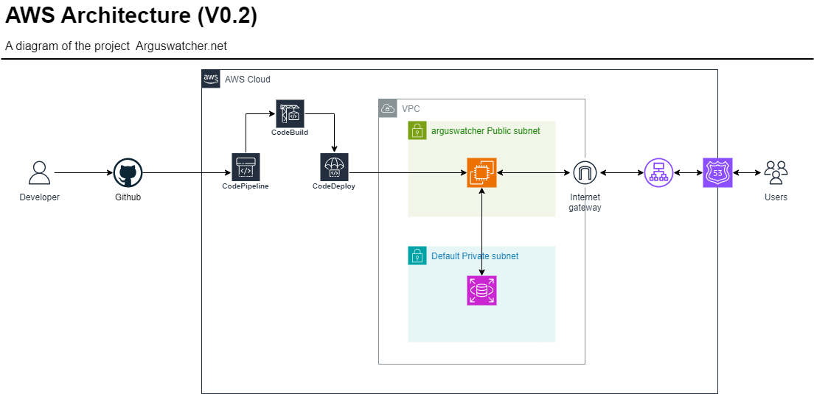

## ArgusWatcher - Document v0.2

[Back](/README.md)

- [ArgusWatcher - Document v0.2](#arguswatcher---document-v02)
- [Requirements](#requirements)
  - [Analysis of last version](#analysis-of-last-version)
  - [Current version](#current-version)
- [Application Development](#application-development)
  - [Create app "AppAccount"](#create-app-appaccount)
  - [Create Login Page](#create-login-page)
  - [Create profile page](#create-profile-page)
  - [Create log out page](#create-log-out-page)
  - [Test locally and push](#test-locally-and-push)
- [Side Lab: using user data for EC2 provision](#side-lab-using-user-data-for-ec2-provision)
- [CI/CD](#cicd)
  - [Create Roles](#create-roles)
  - [Create an EC2 instance](#create-an-ec2-instance)
  - [Configure CodeDeploy](#configure-codedeploy)
  - [Create a CodeBuild](#create-a-codebuild)
  - [Create an application for CodeDeploy](#create-an-application-for-codedeploy)
  - [Create a deployment group for CodeDeploy](#create-a-deployment-group-for-codedeploy)
  - [Create a new CodePipeline](#create-a-new-codepipeline)
  - [Test](#test)
- [Sile Lab: EC2 istance Launch Template + user data + CodePipeline](#sile-lab-ec2-istance-launch-template--user-data--codepipeline)
- [Database configuration](#database-configuration)
  - [Django connect to local MySQL](#django-connect-to-local-mysql)
  - [`django-eviron`](#django-eviron)
  - [Create AWS RDS MySQL](#create-aws-rds-mysql)
  - [Access to RDS instance within EC2 Instance](#access-to-rds-instance-within-ec2-instance)
  - [Configure Deployment](#configure-deployment)
- [AWS Architect](#aws-architect)
- [Summary](#summary)
  - [Challenge and Lesson](#challenge-and-lesson)
  - [Troubleshooting](#troubleshooting)
- [Appendix](#appendix)

---

## Requirements

### Analysis of last version

| Problems                  | Solution                         |
| ------------------------- | -------------------------------- |
| Time-consuming deployment | 1. Use data; 2. CICD             |
| Use of sqlite3            | `django-environ`+`AWS RDS MySQL` |

---

### Current version

- **Django Project:**

  - [x] Account Management (no signup, limited account)
    - [x] Sign-in page
    - [x] Profile page
    - [x] Sign-out page
  - [x] Connect to MySQL
    - [x] Local MySQL
    - [x] django-environ
  - [x] Connect to RDS

- **AWS Cloud resources:**
  - [x] Side Lab: using user data for EC2 provision
  - [x] CICD
    - [x] CodeBuild
    - [x] CodeDeploy
    - [x] CodePipeline
    - [x] Test CICD
  - [x] Sile Lab: EC2 istance Launch Template + user data + CodePipeline
  - [x] Database
    - [x] Create RDS MySQL
    - [x] Connect
    - [x] Test RDS

---

## Application Development

### Create app "AppAccount"

- Startapp

```py
py manage.py startapp AppAccount
```

- Create model
  - leverage Django User model

```py
from django.db import models
from django.contrib.auth import models


class UserAccount(models.User, models.PermissionsMixin):
    '''
    This class represents a user account, inheriting from the User and permission models.
    custom user class
    multiple inheritance
    User class: to represent registered users of website
    Permission Class: an abstract model that has attributes and methods to cutomize a user model
    '''

    def __str__(self):
        # self.username is a attribute of the super class User.
        return self.username
```

---

### Create Login Page

- **AppAccount/urls.py**

```py
from django.urls import path
from django.contrib.auth.views import LoginView

# URL namespaces
app_name = "AppAccount"

urlpatterns = [
    path("login/", LoginView.as_view(   # using Django LoginView
        template_name="AppAccount/login.html",  # using login.html as template
        extra_context={"title": "Login", "heading": "Login"}  # define a context for render
    ), name="login"), # URL patterns name
]
```

- **AppAccount/template/AppAccount/login.html**

```html
  
<header class="pt-5">
  <h1 class="heading text-center">{{heading}}</h1>
  <hr />
</header>

<div class="row m-3">
  <div class="col-md-8 col-sm-0">
    
  </div>
  <div class="col-md-4 col-sm-12 pt-4">
      
    <form method="post">
       
      <div class="row py-3">
        <button class="btn btn-primary w-100 py-2 my-1" type="submit">
          Login
        </button>
        <a
          class="btn btn-outline-secondary w-100 p-2 my-1"
          href=""
          >Cancel</a
        >
        <input type="hidden" name="next" value="{{ next }}" />
      </div>
    </form>

    <hr />
    <p class="text-body-secondary pb-3">
      Do not have an account?
      <a class="text-body-secondary" href="#">Signup</a>
    </p>
  </div>
</div>

  
```

- **Test**


---

### Create profile page

- **AppAccount/urls.py**

```py
path("profile/", login_required(  # using login_required() decorator, the current urls is required authenticated, otherwise is redirected to login page.
  TemplateView.as_view(     # using Django TemplateView for Views
    template_name="AppAccount/profile.html",  # using profile.html as template
    extra_context={"title": "User Profile", "heading": "User Profile"}  # define a given context for render.
)), name="profile"),    # url pattern name
```

- **AppAccount/template/AppAccount/profile.html**

```html
 
<header class="pt-4">
  <h1 class="heading text-center">{{heading}}</h1>
  <hr />
</header>
<p><strong>Username:</strong> {{ user.username }}</p>
  
```

- Craete super user for testing

```sh
py Arguswatcher/manage.py createsuperuser
# user name
# pwd
# pwd2
```

- Test login and profile


---

### Create log out page

- **AppAccount/urls.py**

```py
path("logout/", LogoutView.as_view(   # using Django LogoutView
        template_name="AppAccount/logout.html", # template
        extra_context={"title": "Log out", "heading": "Log out successful."}  # context for render
    ), name="logout"),  # name of url pattern
```

- Update **nav.html**

```html
<a class="dropdown-item" href=""> Logout </a>
```

- **AppAccount/template/AppAccount/logout.html**

```html
 
<header class="pt-4">
  <h1 class="heading text-center">{{heading}}</h1>
  <hr />
</header>
<div class="row">
  <a href=""> ArgusWatcher </a>
</div>
  
```

- Test


---

### Test locally and push

- Test locally

- Collect static

  - `py Arguswatcher/manage.py collectstatic`

- Migarte

  - `py Arguswatcher/manage.py makemigrations`
  - `py Arguswatcher/manage.py migrate`

- Collect info of dependencies

  - `pip freeze > requirements.txt`

- push to Github
  - `git add -A`
  - `git log --oneline -4`
  - `git commit -m "Implement user authentication features (startapp AppAccount for login, profile, logout)"`
  - `git tag -a v0.2.0.1 -m "version 0.2 development 1"`
  - `git push`

---

## Side Lab: using user data for EC2 provision

- Create a new EC2 instance
  - define user data with bash script deploy_django_ubuntu.sh of V0.1


- Test


- Delete EC2 instance

---

## CI/CD

- `CI/CD`

  - `Continuous Integration and Continuous Deployment/Delivery`
  - the automation of the software development life cycle from dvelopment to production.
  - Steps:
    - Code
    - Build
    - Test
    - Deploy
  - Benefits:
    - Fast code deliery
    - No manaual deployment
    - Minimum errors
    - Cost reduction.
  - Common tools:
    - `GitHub Actions`:automate workflows directly from your GitHub repository.
    - `AWS CodePipeline`: automates the build, test, and deployment phases.

---

### Create Roles

- Create role that allows EC2 instance to call CodeDeploy


- Create role that allows CodeDeploy to call AWS services




---

### Create an EC2 instance

- OS: Ubuntu
- VPC: arguswatcherVPC
- Enable Key pair
- SG: SSH + HTTP
- Tags:
  - Name:arguswatcherServer
  - project:arguswatcher


- Update the IAM Role


- Reboot


---

### Configure CodeDeploy

- Access instance using SSH

```sh
sudo apt update
sudo apt install -y ruby-full     # install ruby-full package
sudo apt install -y wget          # install wget utility
```

- Install CodeDeploy files on EC2

  - Many of the files CodeDeploy relies on are stored in publicly available, AWS region-specific Amazon S3 buckets.
    - These files include installation files for the CodeDeploy agent, templates, and sample application files. We call this collection of files the CodeDeploy Resource Kit.
  - rel:

    - https://docs.aws.amazon.com/codedeploy/latest/userguide/resource-kit.html

  - for us-east-1
    - https://aws-codedeploy-us-east-1.s3.amazonaws.com/latest/install

```sh
# download codedeploy on the EC2
wget https://aws-codedeploy-us-east-1.s3.amazonaws.com/latest/install
# change permission of the install file
sudo chmod +x ./install
# install and log the output to the tmp/logfile.file
sudo ./install auto  > /tmp/logfile
# check whether the CodeDeploy is running
sudo service codedeploy-agent status
```


---

### Create a CodeBuild


- Choose Github as source


---

### Create an application for CodeDeploy


### Create a deployment group for CodeDeploy


- Select the correct tag held by the target EC2 instance.


- At this stage disable load balancer.
  - It can enbale later when CICD work well.


---

### Create a new CodePipeline


---

### Test

- Commit and push
- View in CodeDeploy


- View in public IP


- edite home page local
- commit and push
- View in browser


---

## Sile Lab: EC2 istance Launch Template + user data + CodePipeline

- Create an EC2 Launch Template

```sh
#!/bin/bash

# Program Name: userdata_codedeploy.sh
# Author name: Wenhao Fang
# Date Created: Jan 1st 2024
# Date updated: Jan 1st 2024
# Description of the script:
#   Script for user data, including installation of codedeploy.

###########################################################
## Arguments
###########################################################
P_HOME=/home/ubuntu # path of home dir
P_LOG=${P_HOME}/log # log file

log() {
    echo -e "$(date +'%Y-%m-%d %R'): ${1}" >>$P_LOG
}

touch $P_LOG

# update the package on Linux system.
sudo DEBIAN_FRONTEND=noninteractive apt-get -y update &&
    log "update os packages." || log "Fail: update os packages"

# upgrade the package on Linux system.
sudo DEBIAN_FRONTEND=noninteractive apt-get -y upgrade &&
    log "upgrade os packages." || log "Fail: upgrade os packages"

# install ruby-full package
sudo apt install -y ruby-full &&
    log "install ruby-full package" || log "Fail: install ruby-full package"

# install wget utility
sudo apt install -y wget &&
    log "install wget utility" || log "Fail: install wget utility"

# download codedeploy on the EC2
wget https://aws-codedeploy-us-east-1.s3.amazonaws.com/latest/install &&
    log "download codedeploy" || log "Fail: download codedeploy"

# change permission of the install file
sudo chmod +x ./install &&
    log "change permission" || log "Fail: change permission"

# install and log the output to the tmp/logfile.file
sudo ./install auto >/tmp/logfile &&
    log "install and log the output" || log "Fail: install and log the output"


```


---

- Create an EC2 instance using template to install CodeDeploy
  - test CodeDeploy
  - attach IAM role, otherwise deployment will time out.

```sh
# check whether the CodeDeploy is running
sudo service codedeploy-agent status
```


---

- update deployment group


- Commit and push

---

## Database configuration

### Django connect to local MySQL

- install `pymysql` package for mysql

```sh
pip install pymysql
```

- Add codes into `__init__.py`

```py
import pymysql
pymysql.install_as_MySQLdb()
```

---

- `settings.py`

```py
# region Database
DATABASES = {
    "default": {
        "ENGINE": "django.db.backends.mysql",
        "NAME": "",   # database name
        "USER": "",   # user name
        "PASSWORD": "", #pwd
        "HOST": "localhost",  # local
        "PORT": "3306",
    }
}
```


---

- Test Django local
  - Create superuser
  - run server locally


---

### `django-eviron`

- `django-environ`

  - the Python package that allows to configure Django application using environment variables obtained from an environment file and provided by the OS.

- Why?

  - Critical parameters, such as SECRET_KEY are stored in the settings.py which is unencrypted and exposed on the Github, resulting a security risk.
  - Central management of parameters.

- **install package**
  - ref:https://pypi.org/project/django-environ/

```py
pip install django-environ
```

- create an environment file `.env` in the root of the project.

```conf
DEBUG=True
SECRET_KEY=SECRET_KEY
DATABASE=DB_NAME
HOST=DB_HOST
USER=DB_USER
PASSWORD=DB_PWD
```

---

- Modify settings.py

```py
from pathlib import Path
import environ
import os

env = environ.Env(
    # set casting, default debug value is true.
    DEBUG=(bool, True)
)
# path of env file
environ.Env.read_env(Path(Path(BASE_DIR).parent.parent, '.env'))  # the env file is placed in the same dir as the repo

# False if not in os.environ because of casting above
SECRET_KEY = env('SECRET_KEY')
DEBUG = env('DEBUG')

# region Database
DATABASES = {
    "default": {
        "ENGINE": "django.db.backends.mysql",
        "NAME": env('DATABASE'),   # database name
        "USER": env('USER'),   # user name
        "PASSWORD": env('PASSWORD'), #pwd
        "HOST": env('HOST'),  # local
        "PORT": "3306",
    }
}
```

- Test locally

---

### Create AWS RDS MySQL


- To make dev and test easier, enable Public acces.


---

### Access to RDS instance within EC2 Instance

- Install MySQL client

```sh
sudo apt update
sudo apt install -y mysql-client
```


- Connection with RDS within EC2 instance


- Create database for the project


---

### Configure Deployment

- Problem:

  - The env file that is required to run app is not in the repo. Thus, it is not create or configure when commiting and pushing.
  - It can be create or configure with SSH to EC2 instance. However, it means a manual configuration per commit and push, which do not make sense with CICD.

- Solution:
  - Creation of env file can be executed when the EC2 instance is created. Therefore, it can leverage the use data to create env file.
  - To improve efficiency, EC2 template can be used.
    - One reason is that the template cannot be access publicly, and thus the secret info in the env file will not be exposed.
    - The another reason is that user data can be edited within the template, providing an efficient way to manage env file.
    - Lastly, template can be versioning. When the values in the env file have been changed, a new version of template can be created.

---

- Update the user data within the Launch Template
  - source template: arguswatcherTemplate
  - add Profile: CodeDeploy role
  - user data
  - set default version

```sh
P_HOME=/home/ubuntu # path of home dir

###########################################################
## Create env file
###########################################################
# create env file for django project
P_ENV=${P_HOME}/.env # env file
sudo bash -c "cat >$P_ENV <<ENV_FILE
DEBUG=False
SECRET_KEY='SECRET_KEY'
DATABASE='DATABASE'
HOST='HOST'
USER='USER'
PASSWORD='PASSWORD'
ENV_FILE" &&
    log "create env file." || log "Fail: create env file."

```

---

- update dependencies: pip freeze
- check `.gitignore`, make sure env file will not add and commit.
- commit and push
- Test


- Update Target Group
  - Register targets


- Check at domain name


---

## AWS Architect



---

## Summary

### Challenge and Lesson

- **User Data** is helpful to run a custom bash script when an EC2 instance is provisioned. The skill of bash script is required.
- **CICD** is a efficient way to integrate development, deployment, and operation. AWS CodeDeploy, CodeBuild, and CodePipeline are services for CICD.
  - Install `CodeDeploy` in EC2 instance.
  - Create a project in CodeBuild connecting with `Github`.
  - Create a application and deployment group in `CodeDeploy`.
  - Create a **pipeline** to integrate with source, build, and deploy.
- `AWS RDS MySQL` provides database service.
- `django-environ` can be used to configure Django project to use environment variables.

---

### Troubleshooting

- The EC2 instance called by Pipeline must have **correct Role(EC2RoleCodeDeploy)** and **reboot**. Otherwise, the deployment will timeout.
- The bash scripts involed in CodeDeploy log into the log file created within user data. However, user data script executes as `root` whereas CodeDeploy scripts execute as `ubuntu`, leading to **permission denied** and resulting in failure deployment.
  - Solution: Unified the CodeDeploy scripts with a log method using sudo.
- While the connection via Mysql client can be established, the migrations of Django can fail. The reason is that the migration need authenication using Ubuntu user.


- Solution: A user named "'ubuntu'@'ec2-dns'" need to be created in the Mysql. Otherwise, migrations fails due to access denied.

```sql
/*
ubuntu: the username of ubuntu os
pwd: password
ec2-dns: dns name of the EC2
database_name: database name of the Django app
 */
CREATE USER 'ubuntu'@'ec2-dns' IDENTIFIED BY 'pwd';
GRANT ALL PRIVILEGES ON database_name.* TO 'ubuntu'@'ec2-dns';
FLUSH PRIVILEGES;
```


---

## Appendix

- Bash script to install codedeploy
  - [userdata_codedeploy](./userdata_codedeploy.sh)

---

[TOP](#arguswatcher---document-v02)
