## ArgusWatcher - Document v0.3

[Back](/README.md)

- [ArgusWatcher - Document v0.3](#arguswatcher---document-v03)
- [Requirements](#requirements)
  - [Analysis of precious version](#analysis-of-precious-version)
  - [Current version](#current-version)
- [Application Development - Blog management](#application-development---blog-management)
  - [Create app `AppBlog`](#create-app-appblog)
  - [Blog management](#blog-management)
  - [Hashtag](#hashtag)
  - [Update profile page and Home](#update-profile-page-and-home)
  - [Commit, Push, and Test](#commit-push-and-test)
- [AWS Deployment: CloudFormation](#aws-deployment-cloudformation)
  - [Side Lab: CloudFormation Tutorial](#side-lab-cloudformation-tutorial)
  - [Create VPC](#create-vpc)
  - [Create Auto Scaling Group](#create-auto-scaling-group)
- [AWS Architect](#aws-architect)
- [Summary](#summary)
  - [Challenge and Lesson](#challenge-and-lesson)
  - [Troubleshooting](#troubleshooting)

---

## Requirements

### Analysis of precious version

| Problem                          | Solution       |
| -------------------------------- | -------------- |
| Time-consuming Manual Deployment | CloudFormation |

---

### Current version

- **Django Project:**

  - [x] Blog Management
    - [x] List
    - [x] Create
    - [x] Update
    - [x] Delete
    - [x] Publish
    - [x] HashTag
    - [x] filter by hashtag
    - [x] attach hashtag
  - [x] Design Home Page

- **AWS Cloud resources:**
  - [ ] Auto Scalling Group
  - [ ] Multi-AZ
  - [ ] RDS replica

---

## Application Development - Blog management

- Blog lifecycle:

  - 1. CRUD draft
  - 2. post a blog(draft -> blog)
  - 2. RUD blog

- only login user can crud a draft.
- only login user can ud a blog.
- Anonymous user can read a blog.
- No comment function for the current version.
- Hashtag managed by admin

---

### Create app `AppBlog`

- Startapp

```sh
py manage.py startapp AppBlog
```

- Create Blog model

  - Each blog is related to an authenticated user.
  - use foreign key "auth.User" to reference the user model.

```py
from django.db import models
from django.urls import reverse
from django.utils import timezone
from django.utils.text import slugify


class Blog(models.Model):
    ''' Table of blog '''

    # author, refer to auth User, Only the registered user can post.
    author = models.ForeignKey("auth.User",
                               on_delete=models.CASCADE)
    # # the title of current post, allow only 64 characters
    title = models.CharField(max_length=64)
    # the content of current post, Can be blank or null
    content = models.TextField(blank=True, null=True)
    # created time, automatically set the field to now when the object is first created.
    created_at = models.DateTimeField(auto_now_add=True)
    # last updated time, automatically set the field to now every time the object is saved.
    updated_at = models.DateTimeField(auto_now=True)
    # the date when current post is set to be published,  It can be blan or null when the post is not set published.
    post_at = models.DateTimeField(blank=True, null=True)
    hashtags = models.ManyToManyField('Hashtag')

    # model metadata
    class Meta:
        # OrderBy created_date in descending order.
        ordering = ["-created_at"]
        # set index for post table
        indexes = [
            models.Index(fields=["author",]),
            models.Index(fields=["title",]),
            models.Index(fields=["created_at",]),
            models.Index(fields=["updated_at",]),
        ]

    def __str__(self):
        ''' str() method of current post'''
        return f'{self.title} - {self.author}'

    def get_absolute_url(self):
        ''' the url for current blog '''
        # using reverse to transform URLConf name into a url of current blog.
        # passing the pk of current blog an argument.
        return reverse("blog_detail", kwargs={"pk": self.pk})

    def post_draft(self):
        ''' post a draft into a blog '''
        if not self.post_at:
            self.post_at = timezone.now()
            self.save()
```

---

- Register Blog model in the admin

```py
# AppBlog/admin.py
from django.contrib import admin
from .models import Blog

admin.site.register(Blog)
```

---

- Migrate

  - `py manage.py makemigrations`
  - `py manage.py migrate`

---

- log in admin page to create a new blog for testing.

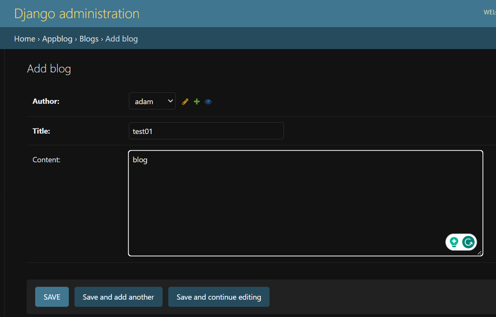

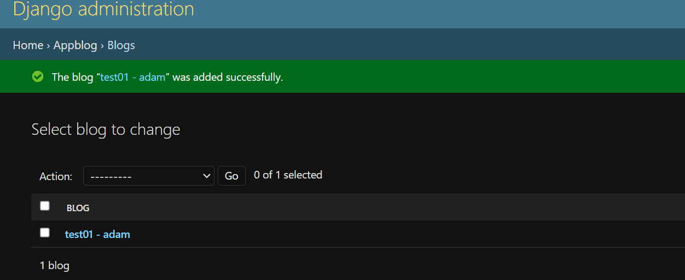

---

### Blog management

- Views:list

```py
class DraftListView(LoginRequiredMixin, ListView):
    ''' list all drafts '''
    model = Blog
    template_name = 'AppBlog/blog_draft_list.html'
    context_object_name = 'draft_list'
    extra_context = {"heading": "Draft List",
                     "title": "Draft List"}  # context for render

    def get_queryset(self):
        # Filter drafts based on the currently logged-in user
        return Blog.objects.filter(author=self.request.user, post_at__isnull=True)

    def get_context_data(self, **kwargs):
        context = super().get_context_data(**kwargs)
        context['hashtags'] = Hashtag.objects.all()
        return context
```

- Urls

```py
from django.urls import path
from .views import (DraftListView)

app_name = 'AppBlog'

urlpatterns = [
    # blog management
    path('drafts/', DraftListView.as_view(), name='draft_list'),
]
```

- Project urls

```py
    path('blog/', include('AppBlog.urls')),
```

- template
  - create a AppBlog_base.html template for AppBlog extending from the base.html

```html
 
<header class="pt-4"></header>
<hr />
<div class="container-fluid">
  <div class="row">
    <div class="col-lg-3 col-md-12">
      
    </div>
    <div class="col-lg-9 col-md-12"></div>
  </div>
</div>

```

- Each page of AppBlog extends from the AppBlog_base.html.

```html
 
<div>
  
  <article class="py-4">
    <h3 class="link-body-emphasis">
      <a href=""> {{blog.title}} </a>
    </h3>
    <p class="fw-normal text-body-secondary">
      <span> {{blog.created_at|date:'F-d, Y G:i:s'}} by {{blog.author}} </span>
    </p>

    <p>{{blog.content|safe|linebreaks|truncatewords_html:48}}</p>
    <hr />
  </article>

  
  <p class="fs-4">No draft.</p>
  
</div>
 
<script>
  tinymce.init({
    selector: ".editor",
  });
</script>

```

- Test

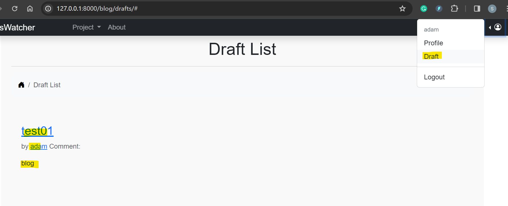

---

- Same approach serves create, detail, update, delete pages.

---

### Hashtag

- model
  - Many to many relationship
  - A hashtag can be related to multiple blogs.
  - A blog can be related to multiple hashtags.
  - rel:
    - https://docs.djangoproject.com/en/5.0/topics/db/examples/many_to_many/

```py
class Blog(models.Model):
    ''' Table of blog '''
    hashtags = models.ManyToManyField('Hashtag')

class Hashtag(models.Model):
    # name of hashtag
    name = models.CharField(
        max_length=32,  # less than 32 chars
        unique=True     # must be unique
    )
    slug = models.SlugField(
        unique=True,        # must be unique
        allow_unicode=True,  # accepts Unicode letters
    )

    def __str__(self):
        return self.name

    def save(self, *args, **kwargs):
        self.slug = slugify(self.name)
        super().save(*args, **kwargs)

    def get_absolute_url(self):
        return reverse("AppBlog:hashtag_detail", kwargs={"slug": self.slug})

    class Meta:
        ordering = ["name"]     # default ordered by name
```

---

- Update blog pages to for hashtag pages

---

### Update profile page and Home

- update profile page

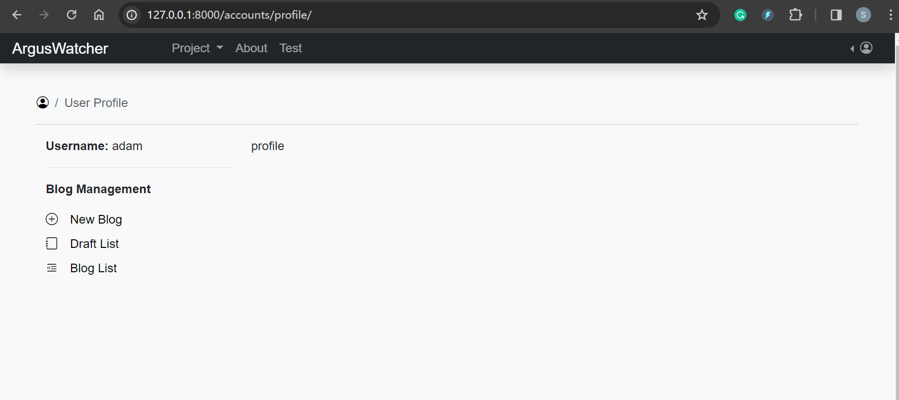

- update home page

---

### Commit, Push, and Test

- Test on domain name

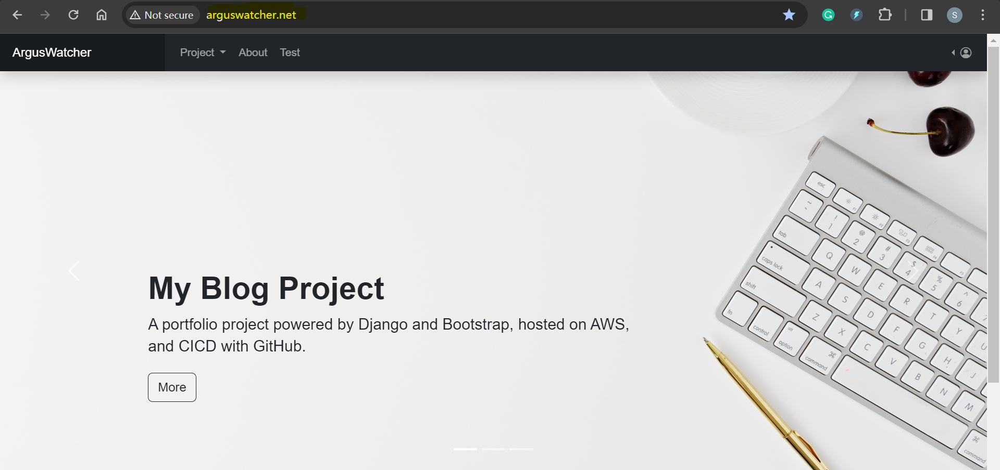

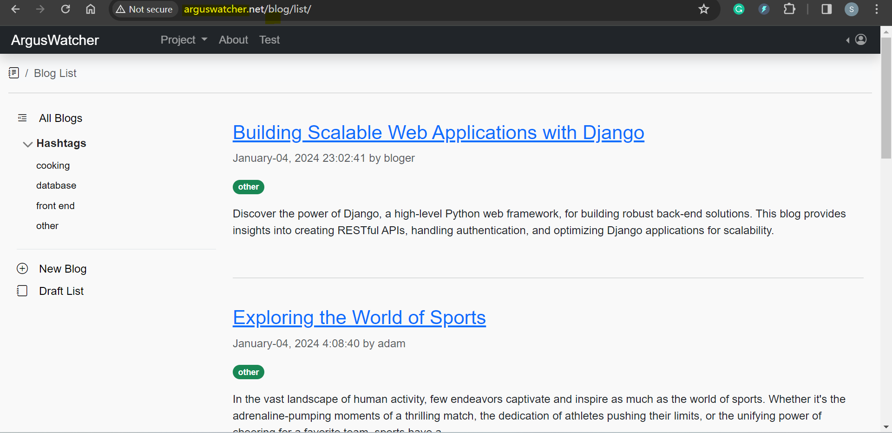

---

## AWS Deployment: CloudFormation

### Side Lab: CloudFormation Tutorial

- ref:
  - https://catalog.workshops.aws/general-immersionday/en-US/basic-modules/800-cfn

---

### Create VPC

- Create a template for VPC

```yaml
Resources:
  # region VPC

  # Create a VPC
  MainVPC:
    Type: AWS::EC2::VPC
    Properties:
      CidrBlock: 10.0.0.0/16
      EnableDnsHostnames: "true"
      EnableDnsSupport: "true"
      Tags:
        - Key: Name
          Value: arguswatcherVPCCfn
        - Key: project
          Value: arguswatcher

  # Create and attach InternetGateway
  InternetGateway:
    Type: AWS::EC2::InternetGateway
    DependsOn: MainVPC
    Properties:
      Tags:
        - Key: Name
          Value: arguswatcherIGWCfn
        - Key: project
          Value: arguswatcher

  # attach IGW
  AttachIGW:
    Type: AWS::EC2::VPCGatewayAttachment
    Properties:
      # reference VPC
      VpcId: !Ref MainVPC
      # reference IGW
      InternetGatewayId: !Ref InternetGateway

  # endregion

  # region Subnets

  # Create Subnet - Public EC 1a
  PublicSubnetEC1a:
    Type: AWS::EC2::Subnet
    Properties:
      VpcId: !Ref MainVPC
      # mind overlap
      CidrBlock: 10.0.10.0/24
      AvailabilityZone: "us-east-1a"
      # enable a public IPv4 address
      MapPublicIpOnLaunch: true
      Tags:
        - Key: Name
          Value: arguswatcherPublicSubnetEC1a
        - Key: project
          Value: arguswatcher

  # Create Subnet - Public EC 1b
  PublicSubnetEC1b:
    Type: AWS::EC2::Subnet
    Properties:
      VpcId: !Ref MainVPC
      # mind overlap
      CidrBlock: 10.0.20.0/24
      # multi-AZ
      AvailabilityZone: "us-east-1b"
      # enable a public IPv4 address
      MapPublicIpOnLaunch: true
      Tags:
        - Key: Name
          Value: arguswatcherPublicSubnetEC1b
        - Key: project
          Value: arguswatcher

  # Create Subnet - Private DB 1a
  PrivateSubnetDB1a:
    Type: AWS::EC2::Subnet
    Properties:
      VpcId: !Ref MainVPC
      # mind overlap
      CidrBlock: 10.0.30.0/24
      AvailabilityZone: "us-east-1a"
      Tags:
        - Key: Name
          Value: arguswatcherPrivateSubnetDB1a
        - Key: project
          Value: arguswatcher

  # Create Subnet - Private DB 1b
  PrivateSubnetDB1b:
    Type: AWS::EC2::Subnet
    Properties:
      VpcId: !Ref MainVPC
      # mind overlap
      CidrBlock: 10.0.40.0/24
      # multi-AZ
      AvailabilityZone: "us-east-1b"
      Tags:
        - Key: Name
          Value: arguswatcherPrivateSubnetDB1b
        - Key: project
          Value: arguswatcher
  # endregion

  # region Route Table

  # Create and Set Public Route Table
  PublicRouteTable:
    Type: AWS::EC2::RouteTable
    Properties:
      VpcId: !Ref MainVPC
      Tags:
        - Key: Name
          Value: arguswatcherPublicRouteTable
        - Key: project
          Value: arguswatcher

  # configure Route Table
  PublicSubnetRoute:
    Type: "AWS::EC2::Route"
    DependsOn: AttachIGW
    Properties:
      RouteTableId: !Ref PublicRouteTable
      DestinationCidrBlock: 0.0.0.0/0
      GatewayId: !Ref InternetGateway
  # endregion

  # region Associate Public Subnets to Public Route Table
  PublicSubnet1aRouteTableAssociation:
    Type: "AWS::EC2::SubnetRouteTableAssociation"
    Properties:
      SubnetId: !Ref PublicSubnetEC1a
      RouteTableId: !Ref PublicRouteTable

  PublicSubnet2RouteTableAssociation:
    Type: "AWS::EC2::SubnetRouteTableAssociation"
    Properties:
      SubnetId: !Ref PublicSubnetEC1b
      RouteTableId: !Ref PublicRouteTable
  # endregion

  # region Security Groups

  # Create Security Group for HTTP
  HttpSecurityGroup:
    Type: AWS::EC2::SecurityGroup
    Properties:
      GroupDescription: Allow traffic of HTTP
      VpcId: !Ref MainVPC
      SecurityGroupIngress:
        - IpProtocol: tcp
          FromPort: 80
          ToPort: 80
          CidrIp: 0.0.0.0/0 # Allow incoming traffic from any IP for HTTP
      Tags:
        - Key: Name
          Value: arguswatcherSGHttp
        - Key: project
          Value: arguswatcher

  # Create Security Group for SSH
  SshSecurityGroup:
    Type: AWS::EC2::SecurityGroup
    Properties:
      GroupDescription: Security group for SSH traffic
      VpcId: !Ref MainVPC
      SecurityGroupIngress:
        - IpProtocol: tcp
          FromPort: 22
          ToPort: 22
          CidrIp: 0.0.0.0/0 # Allow incoming traffic from any IP for SSH
      Tags:
        - Key: Name
          Value: arguswatcherSGSSH
        - Key: project
          Value: arguswatcher

  # endregion
```

- Upload template

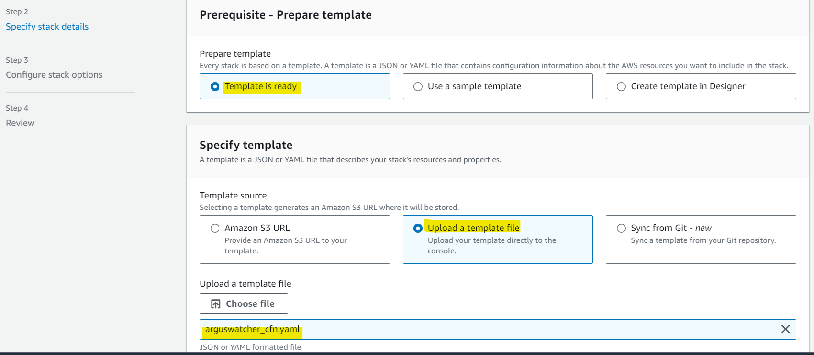

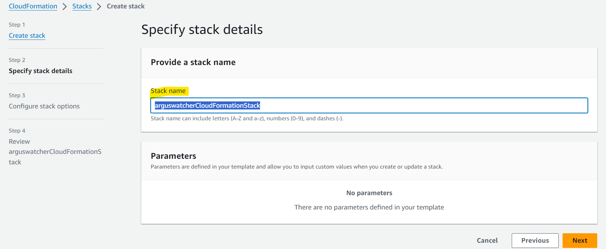

---

- Create a template for ASG

```yaml
# region EC2 ASG

# EC2 instance launch configuration
ServerLaunchConf:
  Type: AWS::AutoScaling::LaunchConfiguration
  Properties:
    ImageId: ami-0261755bbcb8c4a84 # Linux Ubuntu
    InstanceType: t2.micro # free tier
    KeyName: Argus_Lab #  key pair
    SecurityGroups:
      - !Ref HttpSecurityGroup # Reference SG http
      - !Ref SshSecurityGroup # Reference SG SSH
    # update userdata from version 0.2
    UserData:
      Fn::Base64: !Sub |
        #!/bin/bash
        touch /home/ubuntu/userdata_log

        ###########################################################
        ## Install CodeDeploy
        ###########################################################

        # update the package on Linux system.
        sudo apt-get -y update &&
          echo "$(date +'%Y-%m-%d %R'): update os packages." >>/home/ubuntu/userdata_log ||
          echo "$(date +'%Y-%m-%d %R'): Fail: update os packages." >>/home/ubuntu/userdata_log

        # upgrade the package on Linux system.
        DEBIAN_FRONTEND=noninteractive apt-get -y upgrade &&
          echo "$(date +'%Y-%m-%d %R'): upgrade os packages." >>/home/ubuntu/userdata_log ||
          echo "$(date +'%Y-%m-%d %R'): Fail: upgrade os packages." >>/home/ubuntu/userdata_log

        # install ruby-full package
        sudo apt install -y ruby-full &&
          echo "$(date +'%Y-%m-%d %R'): install ruby-full package." >>/home/ubuntu/userdata_log ||
          echo "$(date +'%Y-%m-%d %R'): Fail: install ruby-full package." >>/home/ubuntu/userdata_log

        # install wget utility
        sudo apt install -y wget &&
          echo "$(date +'%Y-%m-%d %R'): install wget utility." >>/home/ubuntu/userdata_log ||
          echo "$(date +'%Y-%m-%d %R'): Fail: install wget utility." >>/home/ubuntu/userdata_log

        # download codedeploy on the EC2
        sudo wget https://aws-codedeploy-us-east-1.s3.amazonaws.com/latest/install &&
          echo "$(date +'%Y-%m-%d %R'): download codedeploy." >>/home/ubuntu/userdata_log ||
          echo "$(date +'%Y-%m-%d %R'): Fail: download codedeploy." >>/home/ubuntu/userdata_log

        # change permission of the install file
        sudo chmod +x ./install &&
          echo "$(date +'%Y-%m-%d %R'): change permission." >>/home/ubuntu/userdata_log ||
          echo "$(date +'%Y-%m-%d %R'): Fail: change permission." >>/home/ubuntu/userdata_log

        # install and log the output to the tmp/logfile.file
        sudo ./install auto >/tmp/logfile &&
          echo "$(date +'%Y-%m-%d %R'): install and log the output." >>/home/ubuntu/userdata_log ||
          echo "$(date +'%Y-%m-%d %R'): Fail: install and log the output." >>/home/ubuntu/userdata_log

        ###########################################################
        ## Create env file
        ###########################################################
        # create env file for django project
        sudo bash -c "cat >/home/ubuntu/.env <<ENV_FILE
        DEBUG=False
        SECRET_KEY='SECRET_KEY'
        DATABASE='DATABASE'
        HOST='HOST'
        USER='USER'
        PASSWORD='PASSWORD'
        ENV_FILE" &&
          echo "$(date +'%Y-%m-%d %R'): create env file." >>/home/ubuntu/userdata_log ||
          echo "$(date +'%Y-%m-%d %R'): Fail: create env file." >>/home/ubuntu/userdata_log

        ###########################################################
        ## install mysql package
        ###########################################################
        sudo apt install -y mysql-client &&
          echo "$(date +'%Y-%m-%d %R'): install mysql package." >>/home/ubuntu/userdata_log ||
          echo "$(date +'%Y-%m-%d %R'): Fail: install mysql package." >>/home/ubuntu/userdata_log

# create asg
AutoScalingGroup:
  Type: AWS::AutoScaling::AutoScalingGroup
  Properties:
    AvailabilityZones:
      - us-east-1a
      - us-east-1b
    # The name of the launch configuration to use to launch instances.
    LaunchConfigurationName: !Ref ServerLaunchConf
    MinSize: 2 # The minimum size of the group.
    MaxSize: 4 # The maximum size of the group.
    DesiredCapacity: 2
    VPCZoneIdentifier:
      - !Ref PublicSubnetEC1a # 1a subnet
      - !Ref PublicSubnetEC1b # 1a subnet
    # this is no the tags for asg, but for all the instance managed by asg
    Tags:
      - Key: Name
        Value: arguswatcherServer
        PropagateAtLaunch: true
      - Key: project
        Value: arguswatcher
        PropagateAtLaunch: true

ScalingPolicy:
  Type: AWS::AutoScaling::ScalingPolicy
  Properties:
    AdjustmentType: ChangeInCapacity
    AutoScalingGroupName: !Ref AutoScalingGroup
    Cooldown: 300
    ScalingAdjustment: 1
# endregion
```

---

### Create Auto Scaling Group

- Ref:

  - https://docs.aws.amazon.com/AWSCloudFormation/latest/UserGuide/aws-resource-autoscaling-launchconfiguration.html#cfn-autoscaling-launchconfiguration-securitygroups

- Update stack
  - 2 instances within 2 different subnet

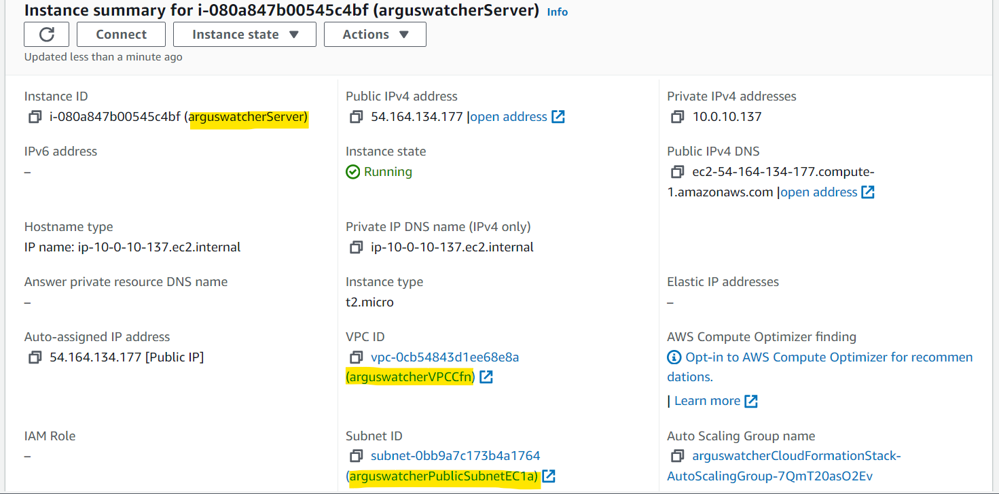

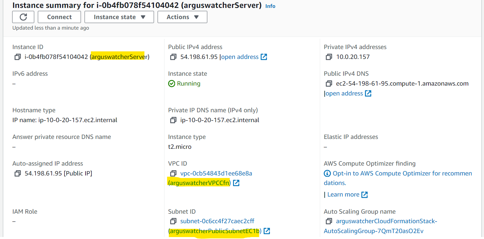

---

---

## AWS Architect

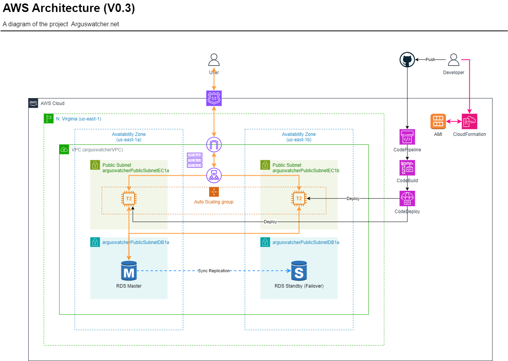

- Muti-AZ, three tiers website application
  - AZ: us-east-1a, us-east-1b
  - VPC: 1
  - pulic subnets: 2, multi-az
  - private subnets: 2, multi-az

---

## Summary

### Challenge and Lesson

---

### Troubleshooting

---

[TOP](#arguswatcher---document-v03)
