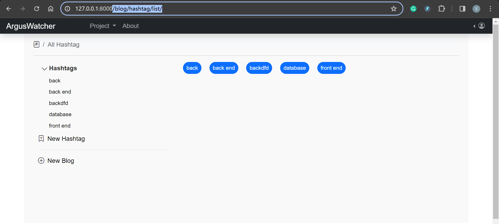
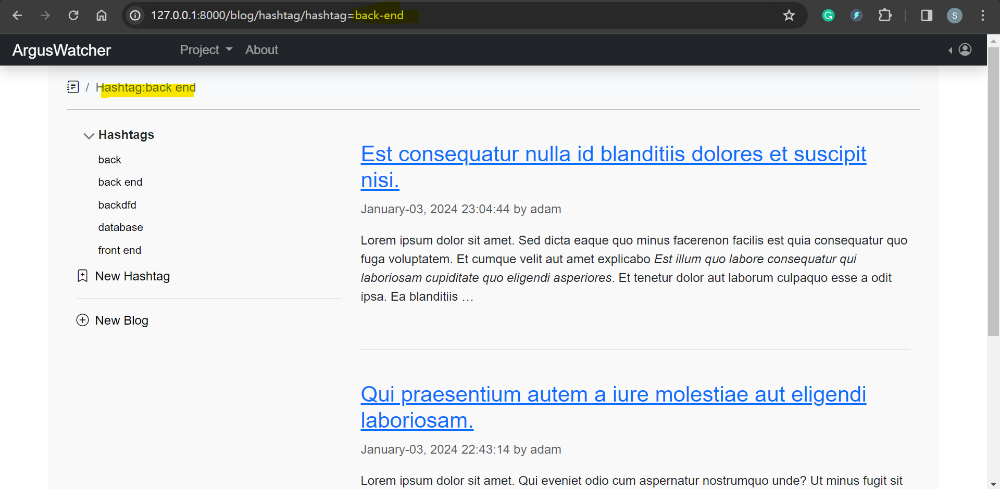
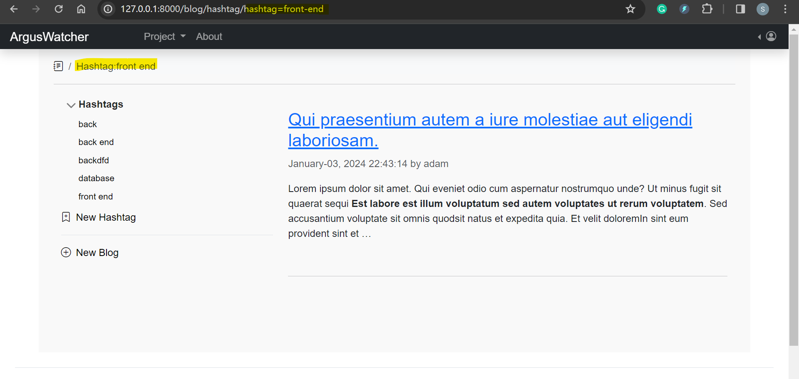
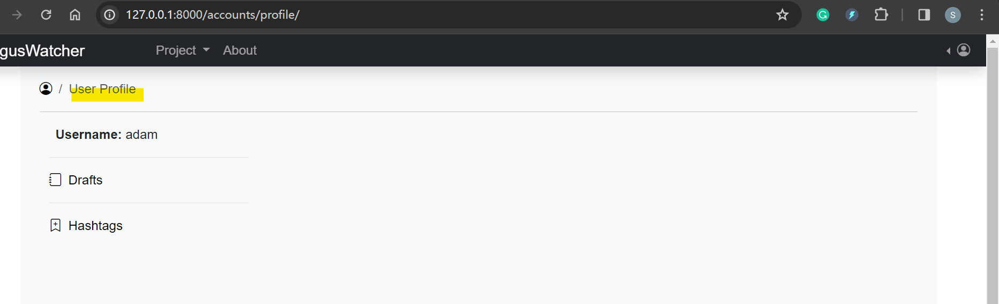

## ArgusWatcher - Document v0.3

[Back](/README.md)

- [ArgusWatcher - Document v0.3](#arguswatcher---document-v03)
- [Requirements](#requirements)
  - [Current version](#current-version)
- [Application Development - Blog management](#application-development---blog-management)
  - [Create app `AppBlog`](#create-app-appblog)
  - [Blog management](#blog-management)
  - [Hashtag management](#hashtag-management)
- [AWS Architect](#aws-architect)
- [Summary](#summary)
  - [Challenge and Lesson](#challenge-and-lesson)
  - [Troubleshooting](#troubleshooting)

---

## Requirements

---

### Current version

- **Django Project:**

  - [x] Blog Management
    - [x] List
    - [x] Create
    - [x] Update
    - [x] Delete
    - [x] Publish
    - [x] filter by hashtag
  - [x] HashTag
    - [x] List
    - [x] Create
    - [ ] Remove

- **AWS Cloud resources:**
  - [ ] Auto Scalling Group
  - [ ] Multi-AZ
  - [ ] RDS replica

---

## Application Development - Blog management

- Blog lifecycle:

  - 1. CRUD draft
  - 2. post a blog(draft -> blog)
  - 2. RUD blog

- only login user can crud a draft.
- only login user can ud a blog.
- Anonymous user can read a blog.
- No comment function for the current version.

---

### Create app `AppBlog`

- Startapp

```sh
py manage.py startapp AppBlog
```

- Create Blog model

  - Each blog is related to an authenticated user.
  - use foreign key "auth.User" to reference the user model.

```py
from django.db import models
from django.urls import reverse


class Blog(models.Model):
    ''' Table of blog '''

    # author, refer to auth User, Only the registered user can post.
    author = models.ForeignKey("auth.User",
                               on_delete=models.CASCADE)
    # # the title of current post, allow only 64 characters
    title = models.CharField(max_length=64)
    # the content of current post, Can be blank or null
    content = models.TextField(blank=True, null=True)
    # created time, automatically set the field to now when the object is first created.
    created_at = models.DateTimeField(auto_now_add=True)
    # last updated time, automatically set the field to now every time the object is saved.
    updated_at = models.DateTimeField(auto_now=True)

    # model metadata
    class Meta:
        # OrderBy created_date in descending order.
        ordering = ["-created_at"]
        # set index for post table
        indexes = [
            models.Index(fields=["author",]),
            models.Index(fields=["title",]),
            models.Index(fields=["created_at",]),
            models.Index(fields=["updated_at",]),
        ]

    def __str__(self):
        ''' str() method of current post'''
        return f'{self.title} - {self.author}'

    def get_absolute_url(self):
        ''' the url for current blog '''
        # using reverse to transform URLConf name into a url of current blog.
        # passing the pk of current blog an argument.
        return reverse("blog_detail", kwargs={"pk": self.pk})
```

---

- Register Blog model in the admin

```py
# AppBlog/admin.py
from django.contrib import admin
from .models import Blog

admin.site.register(Blog)
```

---

- Migrate

  - `py manage.py makemigrations`
  - `py manage.py migrate`

---

- log in admin page to create a new blog for testing.


---

### Blog management

- Views

```py
class DraftListView(LoginRequiredMixin, ListView):
    model = Blog

    template_name = 'AppBlog/blog_list.html'
    context_object_name = 'blog_list'
    extra_context = {"heading": "Draft List",
                     "title": "Draft List"}  # context for render

    def get_queryset(self):
        # Filter drafts based on the currently logged-in user
        return Blog.objects.filter(author=self.request.user, post_at__isnull=True)
```

- Urls

```py
from django.urls import path
from .views import DraftListView

app_name = 'AppBlog'

urlpatterns = [
    path('drafts/', DraftListView.as_view(), name='draft_list'),
]
```

- Project urls

```py
    path('blog/', include('AppBlog.urls')),
```

- template

```html
 
<header class="pt-4">
  <h1 class="heading text-center">{{heading}}</h1>
  <hr />
  <nav aria-label="breadcrumb">
    <ol class="breadcrumb breadcrumb-chevron p-3 bg-body-tertiary rounded-3">
      <li class="breadcrumb-item">
        <a class="link-body-emphasis" href="">
          <i class="bi bi-house-door-fill"></i>
          <span class="visually-hidden">Home</span>
        </a>
      </li>
      <li class="breadcrumb-item active" aria-current="page">{{heading}}</li>
    </ol>
  </nav>
</header>

<div class="container p-4">
  
  <div class="row">
    <div class="col-8">
      <article class="py-4">
        <h3 class="link-body-emphasis mb-2 heading">
          <a href="#"> {{blog.title}} </a>
        </h3>
        <p class="fw-normal text-body-secondary">
          {{blog.created_date|date:'F d, Y'}} by <a href="#">{{blog.author}}</a>
          Comment: {{blog.comment_set.count}}
        </p>

        <p>{{blog.content|safe|linebreaks|truncatewords_html:72}}</p>
      </article>
    </div>
  </div>
  
  <p class="fs-4">No Data.</p>
  
</div>

```

- Test


---

- Same approach serves create, detail, update, delete pages.

---

### Hashtag management

- model
  - Many to many relationship
  - A hashtag can be related to multiple blogs.
  - A blog can be related to multiple hashtags.
  - rel:
    - https://docs.djangoproject.com/en/5.0/topics/db/examples/many_to_many/

```py
class Blog(models.Model):
    ''' Table of blog '''
    hashtags = models.ManyToManyField('Hashtag')

class Hashtag(models.Model):
    # name of hashtag
    name = models.CharField(
        max_length=32,  # less than 32 chars
        unique=True     # must be unique
    )
    slug = models.SlugField(
        unique=True,        # must be unique
        allow_unicode=True,  # accepts Unicode letters
    )

    def __str__(self):
        return self.name

    def save(self, *args, **kwargs):
        self.slug = slugify(self.name)
        super().save(*args, **kwargs)

    def get_absolute_url(self):
        return reverse("AppBlog:hashtag_detail", kwargs={"slug": self.slug})

    class Meta:
        ordering = ["name"]     # default ordered by name
```

- Create pages

- Due the complexity of front end, relationship between blog and hashtag will be managed in admin site.
- Test locally
  - text sample tool:https://www.loremipzum.com/en/text-generator







- update profile page



- update blog pages


---

## AWS Architect


---

## Summary

### Challenge and Lesson

---

### Troubleshooting

---

[TOP](#arguswatcher---document-v03)
