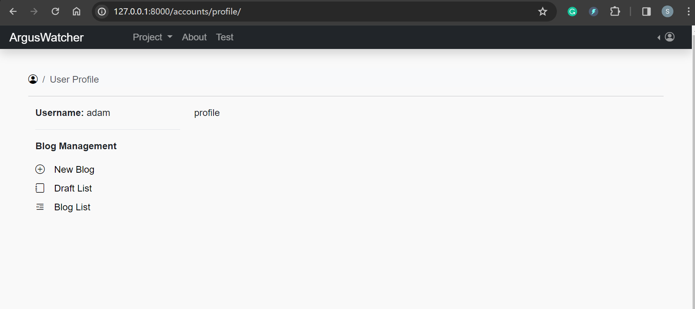

## ArgusWatcher - Document v1.0

[Back](/README.md)

- [ArgusWatcher - Document v1.0](#arguswatcher---document-v10)
- [Requirements](#requirements)
  - [Analysis of precious version](#analysis-of-precious-version)
  - [Current version](#current-version)
- [Application Development - Blog management](#application-development---blog-management)
  - [Create app `AppBlog`](#create-app-appblog)
  - [Blog management](#blog-management)
  - [Hashtag](#hashtag)
  - [Update profile page and Home](#update-profile-page-and-home)
  - [Commit, Push, and Test](#commit-push-and-test)
  - [Release V1.0](#release-v10)
- [AWS Deployment: CloudFormation](#aws-deployment-cloudformation)
  - [Side Lab: CloudFormation Tutorial](#side-lab-cloudformation-tutorial)
  - [Provision VPC, subnets, and ASG](#provision-vpc-subnets-and-asg)
  - [Reflection on Deployment with Cloudformation](#reflection-on-deployment-with-cloudformation)
- [AWS Architect](#aws-architect)
- [Summary](#summary)
  - [Challenge and Lesson](#challenge-and-lesson)
  - [Troubleshooting](#troubleshooting)
- [Appendix](#appendix)

---

## Requirements

### Analysis of precious version

| Problem                          | Solution       |
| -------------------------------- | -------------- |
| Time-consuming Manual Deployment | CloudFormation |

---

### Current version

- **Django Project:**

  - [x] Blog Management
    - [x] List
    - [x] Create
    - [x] Update
    - [x] Delete
    - [x] Publish
    - [x] HashTag
    - [x] filter by hashtag
    - [x] attach hashtag
  - [x] Design Home Page

- **AWS Cloud resources:**
  - [x] CloudFormation provision
  - [x] Auto Scalling Group
  - [x] Multi-AZ

---

## Application Development - Blog management

- Blog lifecycle:

  - 1. CRUD draft
  - 2. post a blog(draft -> blog)
  - 2. RUD blog

- only login user can crud a draft.
- only login user can ud a blog.
- Anonymous user can read a blog.
- No comment function for the current version.
- Hashtag managed by admin

---

### Create app `AppBlog`

- Startapp

```sh
py manage.py startapp AppBlog
```

- Create Blog model

  - Each blog is related to an authenticated user.
  - use foreign key "auth.User" to reference the user model.

```py
from django.db import models
from django.urls import reverse
from django.utils import timezone
from django.utils.text import slugify


class Blog(models.Model):
    ''' Table of blog '''

    # author, refer to auth User, Only the registered user can post.
    author = models.ForeignKey("auth.User",
                               on_delete=models.CASCADE)
    # # the title of current post, allow only 64 characters
    title = models.CharField(max_length=64)
    # the content of current post, Can be blank or null
    content = models.TextField(blank=True, null=True)
    # created time, automatically set the field to now when the object is first created.
    created_at = models.DateTimeField(auto_now_add=True)
    # last updated time, automatically set the field to now every time the object is saved.
    updated_at = models.DateTimeField(auto_now=True)
    # the date when current post is set to be published,  It can be blan or null when the post is not set published.
    post_at = models.DateTimeField(blank=True, null=True)
    hashtags = models.ManyToManyField('Hashtag')

    # model metadata
    class Meta:
        # OrderBy created_date in descending order.
        ordering = ["-created_at"]
        # set index for post table
        indexes = [
            models.Index(fields=["author",]),
            models.Index(fields=["title",]),
            models.Index(fields=["created_at",]),
            models.Index(fields=["updated_at",]),
        ]

    def __str__(self):
        ''' str() method of current post'''
        return f'{self.title} - {self.author}'

    def get_absolute_url(self):
        ''' the url for current blog '''
        # using reverse to transform URLConf name into a url of current blog.
        # passing the pk of current blog an argument.
        return reverse("blog_detail", kwargs={"pk": self.pk})

    def post_draft(self):
        ''' post a draft into a blog '''
        if not self.post_at:
            self.post_at = timezone.now()
            self.save()
```

---

- Register Blog model in the admin

```py
# AppBlog/admin.py
from django.contrib import admin
from .models import Blog

admin.site.register(Blog)
```

---

- Migrate

  - `py manage.py makemigrations`
  - `py manage.py migrate`

---

- log in admin page to create a new blog for testing.


---

### Blog management

- Views:list

```py
class DraftListView(LoginRequiredMixin, ListView):
    ''' list all drafts '''
    model = Blog
    template_name = 'AppBlog/blog_draft_list.html'
    context_object_name = 'draft_list'
    extra_context = {"heading": "Draft List",
                     "title": "Draft List"}  # context for render

    def get_queryset(self):
        # Filter drafts based on the currently logged-in user
        return Blog.objects.filter(author=self.request.user, post_at__isnull=True)

    def get_context_data(self, **kwargs):
        context = super().get_context_data(**kwargs)
        context['hashtags'] = Hashtag.objects.all()
        return context
```

- Urls

```py
from django.urls import path
from .views import (DraftListView)

app_name = 'AppBlog'

urlpatterns = [
    # blog management
    path('drafts/', DraftListView.as_view(), name='draft_list'),
]
```

- Project urls

```py
    path('blog/', include('AppBlog.urls')),
```

- template
  - create a AppBlog_base.html template for AppBlog extending from the base.html

```html
 
<header class="pt-4"></header>
<hr />
<div class="container-fluid">
  <div class="row">
    <div class="col-lg-3 col-md-12">
      
    </div>
    <div class="col-lg-9 col-md-12"></div>
  </div>
</div>

```

- Each page of AppBlog extends from the AppBlog_base.html.

```html
 
<div>
  
  <article class="py-4">
    <h3 class="link-body-emphasis">
      <a href=""> {{blog.title}} </a>
    </h3>
    <p class="fw-normal text-body-secondary">
      <span> {{blog.created_at|date:'F-d, Y G:i:s'}} by {{blog.author}} </span>
    </p>

    <p>{{blog.content|safe|linebreaks|truncatewords_html:48}}</p>
    <hr />
  </article>

  
  <p class="fs-4">No draft.</p>
  
</div>
 
<script>
  tinymce.init({
    selector: ".editor",
  });
</script>

```

- Test


---

- Same approach serves create, detail, update, delete pages.

---

### Hashtag

- model
  - Many to many relationship
  - A hashtag can be related to multiple blogs.
  - A blog can be related to multiple hashtags.
  - rel:
    - https://docs.djangoproject.com/en/5.0/topics/db/examples/many_to_many/

```py
class Blog(models.Model):
    ''' Table of blog '''
    hashtags = models.ManyToManyField('Hashtag')

class Hashtag(models.Model):
    # name of hashtag
    name = models.CharField(
        max_length=32,  # less than 32 chars
        unique=True     # must be unique
    )
    slug = models.SlugField(
        unique=True,        # must be unique
        allow_unicode=True,  # accepts Unicode letters
    )

    def __str__(self):
        return self.name

    def save(self, *args, **kwargs):
        self.slug = slugify(self.name)
        super().save(*args, **kwargs)

    def get_absolute_url(self):
        return reverse("AppBlog:hashtag_detail", kwargs={"slug": self.slug})

    class Meta:
        ordering = ["name"]     # default ordered by name
```

- Update blog pages to for hashtag pages

---

### Update profile page and Home

- update profile page



- update home page

---

### Commit, Push, and Test

- Test on domain name

---

### Release V1.0


---

## AWS Deployment: CloudFormation

### Side Lab: CloudFormation Tutorial

- Tutorial:

  - https://catalog.workshops.aws/general-immersionday/en-US/basic-modules/800-cfn

- Documentation:
  - https://docs.aws.amazon.com/AWSCloudFormation/latest/UserGuide/aws-resource-autoscaling-launchconfiguration.html#cfn-autoscaling-launchconfiguration-securitygroups

---

### Provision VPC, subnets, and ASG

- Create a Yaml file for CloudFomation
- Create a stack


---

- Update template
- Update stack
  - 2 instances within 2 different subnet


---

### Reflection on Deployment with Cloudformation

- Analysis of previous deployment

| Problem                      | Solution                         |
| ---------------------------- | -------------------------------- |
| Repeated bash script testing | Golden AMI + rewrite CICD script |
| Manul CFN stack              | CLI                              |

- **Golden AMI:**

  - can configuration required packages for only one time.
  - S3 versioning can enable version of Golden AMI

- Optimize CICD script:

  - When the project is created using Github, file organization is set. Therefore, the configurations that might be affected by the file structure actually are unchanged. They can actually move to the creation of the Golden AMI. The script related to file organization can be optimized. Only focus on the dynamic configuration such as install dependencies.

- **Central** Management of codes and infrastructures:
  - Github is the central repo of codes, also is the trigger of CICD, caused by Git command.
  - CFN file is the central template of provision. It can be triggered by the CLI command.
  - Therefore, **CLI command** provide a central management of CICD and cloud resources provisions.

---

## AWS Architect


- Muti-AZ, three tiers website application
  - AZ: us-east-1a, us-east-1b
  - VPC: 1
  - pulic subnets: 2, multi-az
  - private subnets: 2, multi-az
  - EC2 instance: 2, multi-az
  - RDS instacne: 1 (standby instance not available due to limited budget)

---

## Summary

### Challenge and Lesson

- Front end design is challenging.
  - Styling and images is not a binary job, but a task of aesthetics.
- Many-to-many relationship
  - can use `models.ManyToManyField`
  - not need to use intermediate table.
- CloudFormation need more pratice
  - The current version praticed the use of CloudFormation which is a useful infrastructure-as-code (IaC) tool.However, it requires a deep understanding of each services.
  - In the future version, the combinations of CFN + CLI and CFN + SDK are the topic.
- Demand of central control
  - A simple blog app need multiple services to implement. However, multiple services also means risk of conflicts and low productivity.
  - More lab:
    - git push -> CFN template upload to S3 -> trigger CFN -> SNS send email notification.
    - Golden AMI + CodePipeline
    - SDK boto3: provision

---

### Troubleshooting

- `Tags` in CFN template for ASG is not the tag of ASG itself, but the tags of instances.
- CFN template can include user data. But the script **cannot use variable**. Otherwise, resource creation will fail and rollback.

---

## Appendix

- CloudFormation Template
  - [arguswatcher_cfn](./arguswatcher_cfn.yaml)

---

[TOP](#arguswatcher---document-v10)
